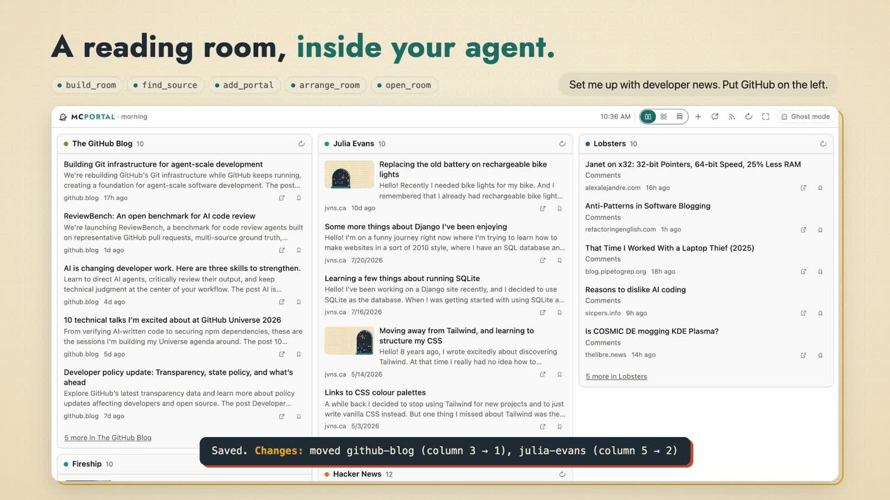

**A reading room that lives in your agent.** MCPortal gives you a room of portals onto sources you choose: Hacker News, GitHub, YouTube channels, subreddits, Bluesky, Mastodon, documentation sites and repos, and any site with a feed. You ask your agent to arrange it, and it does. Articles and docs open in a clean reader with no ads, and your agent reads them with you.

MCPortal is an MCP server with an [MCP Apps](https://modelcontextprotocol.io/extensions/apps/overview) interface, so the room renders inline in the agent you already use: Claude (desktop, web and Claude Code), Codex, or any MCP host that supports apps. It's an early product; feedback from people trying it is welcome.

**[Watch MCPortal in 22 seconds, with sound.](https://mcportal.lol/site/launch.mp4)** The same tour is on [mcportal.lol](https://mcportal.lol).

## What you can do

- **Build a room by talking.** Start from starter packs, then add any site, feed, channel, subreddit or repo by asking. Rearrange it in plain words: "put GitHub on the left", "make the blog wider", "show it as a river". Choose Columns, Shelves, River, Catalogue, Editorial or Paperback; your layout stays with your room.
- **Read the docs you work with.** Point it at a GitHub repo, a docs site or an `llms.txt`, and the docs open as a book in the chat. Your agent reads the same page and answers from it.
- **Read, save and clip.** Articles open in a reader view with figures, captions, code and tables. Continue where you left off, keep a passage, or hand it to a new chat. Save links, and clip quotes, notes, tables and images from the conversation to find again in any chat.
- **Ask what's new.** Your agent picks what's worth reading across everything you follow, and says why.
- **Make a Space your own.** Claim a handle and choose a paperback, magazine or patch, with your own cover, topics and pinned post. Public Spaces have a web page and RSS feed; you control web visibility and whether people can discover you.
- **Share and follow.** Follow other readers, reblog their posts with your own note, and ask your agent to find people who read what you read. Choose Public or Followers only for each post.
- **Keep your data.** Export everything in standard formats: OPML, bookmarks, Markdown.

<table><tr>
<td width="50%"> The uv docs, straight from the repo on GitHub.</td>
<td width="50%"> The river: your feeds and the people you follow, with reblogs.</td>
</tr></table>

## Three ways to use it

| Way | What it means | Start here |
|---|---|---|
| Install the plugin | Runs on your computer. No account; your room lives in `~/.mcportal`. | [Install](docs/how-to/install.md) |
| Use the hosted service | Add `https://mcportal.lol/mcp` as a custom connector and sign in with GitHub. The same room on every device, plus sharing and following. | [Hosted connector](docs/how-to/install.md#hosted-connector) |
| Host your own | Run your own instance on Railway. | [Self-host](docs/how-to/self-host.md) |

New here? The [getting started tutorial](docs/tutorials/getting-started.md) takes you from install to a working room in a few minutes.

Want your agent to set up the hosted connection? Use the [copyable setup prompt](docs/how-to/install.md#ask-your-agent), also available in the site's [Get it section](https://mcportal.lol/#get-it). Coding agents can configure supported hosts; other agents can walk you through the settings and GitHub sign-in.

## Recent additions

The latest reading features are listed below. The [changelog](CHANGELOG.md) tracks their release status; hosted and plugin availability follows deployments and [releases](https://github.com/lbliii/mcportal/releases). Check your installed version before trying them.

| Feature | What to try | Guide |
|---|---|---|
| **Recall Shelf** | "Find what I saved or clipped about databases." Search saved links, clip text and reading history together. | [Organize reading](docs/how-to/organize-reading.md#find-something-again) |
| **Desks, comparisons and trails** | Keep related sources and notes together, compare two or three sources, or work through an ordered reading path. Collections stay private. | [Organize reading](docs/how-to/organize-reading.md) |
| **Finite catch-up** | Choose a bounded set of unseen stories and resume it later. New arrivals wait for another session. | [Catch up](docs/how-to/organize-reading.md#finish-a-bounded-catch-up) |
| **Changes and Upcoming** | Follow changes to a page or repo's releases, or dated events from a public calendar or verified artist. | [Watch reading and events](docs/how-to/watch-reading.md) |
| **Shop** | Preview a supported Shopify store, confirm a collection or sales-only follow, and check arrivals, price drops and saved-product restocks on demand. | [Follow stores](docs/how-to/follow-stores.md) |
| **Automatic Space sections** | Preview eligible sources and people you follow, then choose which lists signed-in visitors can see. | [Customize your Space](docs/how-to/customize-space.md#show-sources-and-people) |

## Documentation

The [documentation index](docs/index.md) lists every page. The ones most people want:

- [Getting started](docs/tutorials/getting-started.md)
- [Install on each host](docs/how-to/install.md)
- [Customize your Space](docs/how-to/customize-space.md)
- [Organize reading](docs/how-to/organize-reading.md)
- [Watch reading and events](docs/how-to/watch-reading.md)
- [Follow stores](docs/how-to/follow-stores.md)
- [Tool reference](docs/reference/tools.md)
- [Configuration](docs/reference/configuration.md)
- [Architecture](docs/explanation/architecture.md)
- [Security model](docs/explanation/security.md)
- [Roadmap](docs/plans/README.md)
- [Changelog](CHANGELOG.md)

## Contributing

MCPortal runs from a checkout with no build step. See [CONTRIBUTING.md](CONTRIBUTING.md) to run it locally and send changes.

## Security

Report vulnerabilities as described in [SECURITY.md](SECURITY.md). Please don't open public issues for them.

## License

MCPortal is licensed under the GNU Affero General Public License v3.0. See [LICENSE](LICENSE).
