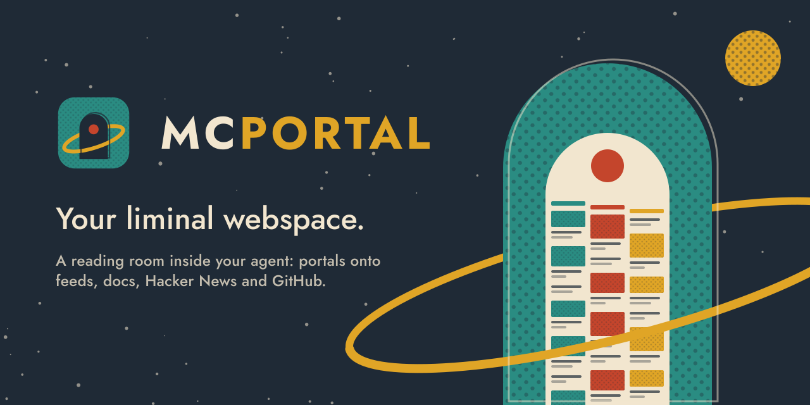
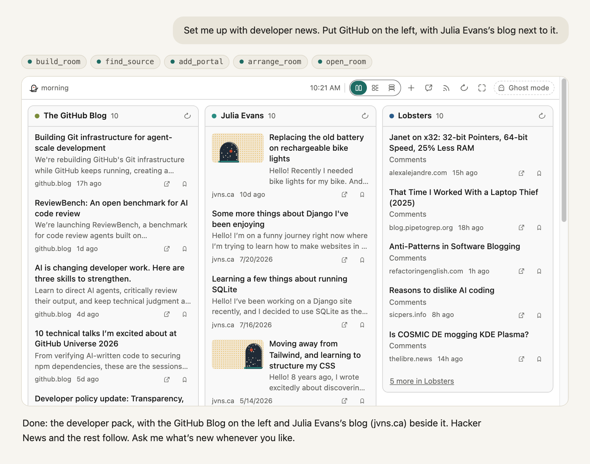
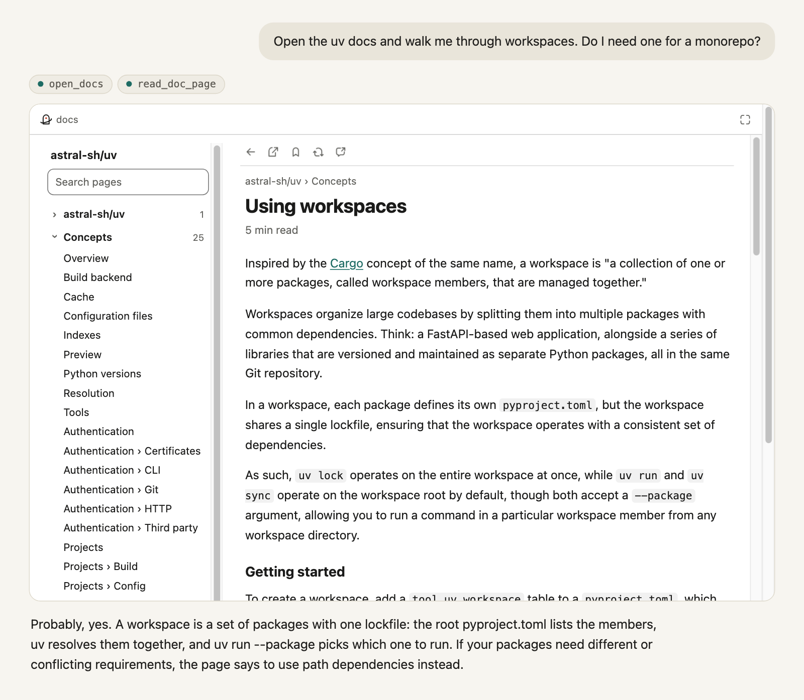
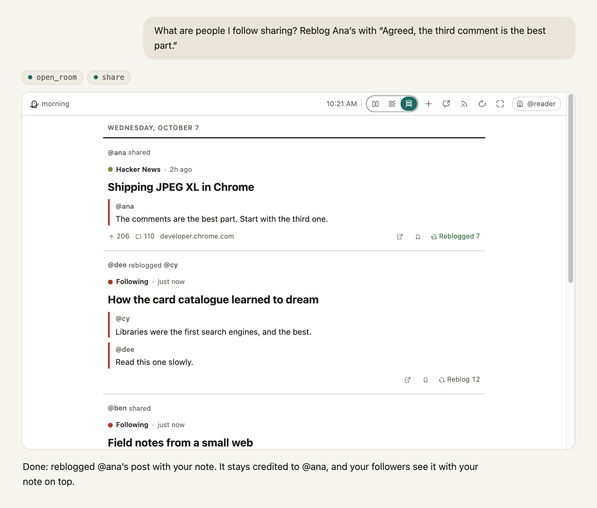

**A reading room that lives in your agent.** MCPortal gives you a room of portals onto sources you choose: Hacker News, GitHub, YouTube channels, subreddits, Bluesky, Mastodon, documentation sites and repos, and any site with a feed. You ask your agent to arrange it, and it does. Articles and docs open in a clean reader with no ads, and your agent reads them with you.

MCPortal is an MCP server with an [MCP Apps](https://modelcontextprotocol.io/extensions/apps/overview) interface, so the room renders inline in the agent you already use: Claude (desktop, web and Claude Code), Codex, or any MCP host that supports apps.

## What you can do

- **Build a room by talking.** Start from starter packs, then add any site, feed, channel, subreddit or repo by asking. Rearrange it in plain words: "put GitHub on the left", "make the blog wider", "show it as a river".
- **Read the docs you work with.** Point it at a GitHub repo, a docs site or an `llms.txt`, and the docs open as a book in the chat. Your agent reads the same page and answers from it.
- **Read, save and clip.** Articles open in a reader view. Save links, and clip quotes, notes, tables and images from the conversation to find again in any chat.
- **Ask what's new.** Your agent picks what's worth reading across everything you follow, and says why.
- **Share and follow.** Sign in for a Space of what you share. Follow other readers, reblog their posts with your own note, and ask your agent to find people who read what you read.
- **Keep your data.** Export everything in standard formats: OPML, bookmarks, Markdown.

<table><tr>
<td width="50%"> The uv docs, straight from the repo on GitHub.</td>
<td width="50%"> The river: your feeds and the people you follow, with reblogs.</td>
</tr></table>

## Three ways to use it

| Way | What it means | Start here |
|---|---|---|
| Install the plugin | Runs on your computer. No account; your room lives in `~/.mcportal`. | [Install](docs/how-to/install.md) |
| Use the hosted service | Add `https://mcportal.lol/mcp` as a custom connector and sign in with GitHub. The same room on every device, plus sharing and following. | [Hosted connector](docs/how-to/install.md#hosted-connector) |
| Host your own | Run your own instance on Railway. | [Self-host](docs/how-to/self-host.md) |

New here? The [getting started tutorial](docs/tutorials/getting-started.md) takes you from install to a working room in a few minutes.

## Documentation

The [documentation index](docs/index.md) lists every page. The ones most people want:

- [Getting started](docs/tutorials/getting-started.md)
- [Install on each host](docs/how-to/install.md)
- [Tool reference](docs/reference/tools.md)
- [Configuration](docs/reference/configuration.md)
- [Architecture](docs/explanation/architecture.md)
- [Security model](docs/explanation/security.md)
- [Roadmap](docs/plans/README.md)
- [Changelog](CHANGELOG.md)

## Contributing

MCPortal runs from a checkout with no build step. See [CONTRIBUTING.md](CONTRIBUTING.md) to run it locally and send changes.

## Security

Report vulnerabilities as described in [SECURITY.md](SECURITY.md). Please don't open public issues for them.

## License

MCPortal is licensed under the GNU Affero General Public License v3.0. See [LICENSE](LICENSE).
