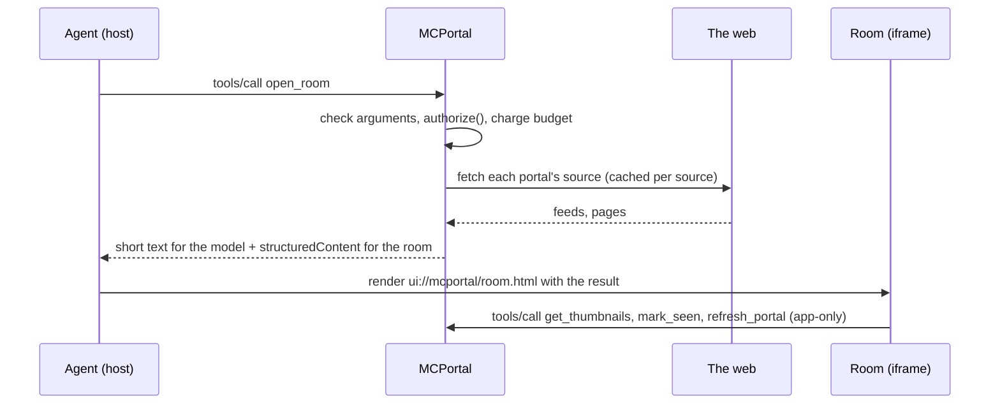

# Architecture

This page explains how MCPortal is put together: the pieces, the path a request takes from your agent to the room, and why the tool surface and protocol support look the way they do. For the tools themselves, see the [tool reference](../reference/tools.md).

## The pieces

MCPortal is one Node.js program. It speaks the Model Context Protocol (MCP) to your agent, fetches the web on your behalf, and ships an MCP App (the room) that the agent's host renders inline in the chat.

| Piece | What it does |
|---|---|
| MCP server | Answers JSON-RPC over stdio (the local plugin) or streamable HTTP at `/mcp` (the hosted connector). One protocol core serves both. |
| Tools | Nearly fifty tools in a dozen areas: room, sources, saved items, reader, docs, clips, reading, highlights, handoffs, account and social. Each is one action. |
| The room | A single self-contained HTML page at `ui://mcportal/room.html`. The host draws it in an iframe; it talks back through the MCP Apps bridge. |
| Adapters | Hacker News, GitHub, RSS/Atom, docs sites and the reader view. Each turns a fetched page into plain-text items or blocks. |
| Discovery | Turns "theverge.com", `r/LocalLLaMA`, `owner/repo` or a profile URL into sources that load. |
| Fetch boundary | Every outbound request goes through one guarded fetcher. See [security](security.md). |
| OAuth server | Hosted only. An OAuth 2.1 authorization server and resource server, with GitHub as the sign-in. |
| Storage | Files in a data directory, or Postgres when `DATABASE_URL` is set. Every store has both. See [local and hosted](local-and-hosted.md). |
| State API | Hosted only. `/api/v1/call` lets a signed-in local MCPortal keep its state in the hosted account. |
| Web pages | Hosted only. Landing, privacy, terms, support, the account page, the admin page and the OAuth consent screen. |

The local server has no runtime dependencies, so the plugin installs without `npm install`. The hosted server adds one, `pg`, loaded only when `DATABASE_URL` is set.

## A request's path

Say you ask your agent to open your room.

1. **Transport.** Over HTTP, the server checks the Host header, the Origin and the bearer token before it reads the message. Over stdio there is one user, the person running the process.
2. **Dispatch.** `src/mcp.ts` finds the tool, checks the arguments against its `inputSchema`, asks the access gate (`authorize()` in `src/access.ts`), and charges the usage budget. A wrong argument is refused with `invalid_argument` and a sentence naming the problem.
3. **The handler** runs with a `ToolContext`: the account, the stores, the fetcher, the cache and a logger. Tools never see a raw account ID from the caller; the context carries it.
4. **Fetching.** Adapters fetch through the guarded fetcher. Results land in a shared, byte-capped cache with a freshness per source (Hacker News 2 minutes, GitHub 5, RSS 10, reader pages an hour, docs outlines a day).
5. **The result** has two parts. The text is short and written for the model, with third-party text fenced as untrusted. `structuredContent` carries everything the room needs to draw.
6. **The room** renders from `structuredContent`. It then calls app-only tools for its own work: thumbnails, seen marks, reading position, refreshes. The model never sees those tools.

Errors take the same path back. An expected failure is an `AppError` with a stable code (`not_found`, `conflict`, `rate_limited`, `upstream_error` and so on) and comes back as `structuredContent.error = { code, message, retryable }`. Anything else is a bug: it's logged with its stack and reported as `internal` with a reference, never with its message.

## Designing the tool surface

The tool list is MCPortal's API. Agents choose tools by reading their names and descriptions, often one at a time after a host's tool search surfaces them. These rules follow from that.

**Specific, self-contained tools.** `search_clips`, `open_docs` and `read_doc_page` stay separate rather than merging into a generic `search` or `read`. A tool found out of context must make sense on its own. The room also opens cards per tool and routes by a tool's arguments, which merged tools would break. Generic merges cut the token count a little and cost clarity, so the count stays moderate by deleting tools that shouldn't exist instead.

**One action per tool.** Hosts show approval prompts and read-only, destructive and open-world hints per tool. Those only mean something when each tool does one clear thing. `remove_portal` is its own destructive call so a host can ask before it runs.

**Edit by patch.** `arrange_room` takes named changes (`move`, `width`, `retitle`, `configure`, `name`, `layout`, `openIn`) and applies all or none. Nothing it isn't given can change. "Never drop a portal you weren't asked to" is a guarantee in the code, not a rule the model has to remember. There is no `update_profile` that takes a whole room; don't add one back.

**Scope the list to the caller.** A server lists only what it can do. A local MCPortal in ghost mode doesn't list sharing tools. A hosted account that hasn't joined in socially sees only the ways in (open a Space, follow, claim a handle, report) until it has a handle or follows someone. Hosts cache the tool list per conversation, so tools that unlock mid-conversation arrive in the next one, and the result that unlocks them says so. A local server sends `notifications/tools/list_changed` after signing in or out.

**Budget results like definitions.** A docs page or a room summary costs more tokens than the whole tool list, and it's paid on every call. Heavy results give the model concise text and page long content (`read_doc_page` returns parts). The full data goes to the room in `structuredContent`.

**The room does the app's work.** What the person does in the room (scrolling, opening, reaching the end of an article) is recorded by app-only tools. The model gets a question-shaped tool where it needs one, such as `list_reading` for "what was I reading?".

**One definition per tool.** Each `ToolDef` holds its schema, annotations, access class (`read`, `write`, `fetch`), budget cost and the reach it needs. The docs, the listing manifests and the eval derive from it. A test checks that every tool declares access and cost, and that the read-only hint agrees with its access class. Each tool has a token ceiling in `test/footprint-ceilings.json`.

**A frozen eval.** `evals/tool-selection.ts` holds cases that never change. Renames are declared in `evals/renames.ts`, and changes are judged against a recorded baseline. Rewriting the benchmark to fit a change defeats it.

## Protocol choices

MCPortal implements the protocol core itself rather than using the official SDK. The core is small enough to read in one sitting, and staying dependency-free keeps the plugin install-free.

**Versions.** The server negotiates the 2025-era protocol versions, up to `2025-11-25`. It doesn't yet speak the stateless `2026-07-28` revision. That revision needs more than a new version string: `server/discover`, metadata in each request's `params._meta`, a `resultType` on every result, cache hints on cacheable results, and stricter HTTP header checks. Claiming support by adding the string alone would misrepresent it. Clients that speak both eras fall back to `initialize`; a modern-only client can't use MCPortal yet. The migration is planned in [mcp-spec-2026-07-28.md](../plans/mcp-spec-2026-07-28.md).

**Observing before migrating.** The server logs a bounded record of each `initialize` and each rejected `server/discover`: the requested and selected versions, drawn from a fixed list, and a host category from an exact allowlist (`claude`, `claude_code`, `chatgpt`, `codex` or `unknown`). Client names, version strings, capabilities and account IDs are never logged. These counts are diagnostics only. They never decide access or behavior, and an absence of probes doesn't prove an absence of modern clients.

**HTTP.** `/mcp` takes POSTs only and keeps no session, which suits a server behind a load balancer. It accepts small JSON-RPC batches.

**MCP Apps.** The room uses the MCP Apps extension (`io.modelcontextprotocol/ui`) and its own handshake. It relies only on what the extension provides: `tools/call`, `ui/message`, `ui/update-model-context`, `ui/open-link`, size reports and fullscreen requests. Where a host lacks one, the room degrades and says so. See [host compatibility](../reference/host-compatibility.md).

## Contracts that hold it together

A few rules keep the code honest as it grows.

- **Every store has a contract.** File, memory, Postgres and (for a linked computer) remote stores implement the same interface. `test/store-contract.test.ts` runs one suite against each, so limits and behavior can't drift between local and hosted.
- **Atomic room edits.** `ProfileStore.update(change)` is the only way to change a room. It holds a per-user lock (a mutex on files, an advisory lock in a transaction on Postgres), so two tool calls at once can't lose each other's change. `change` must be pure and synchronous, which also lets a linked computer retry it after a conflict.
- **A failed read is never empty.** Shared documents (accounts, public profiles, social, OAuth) throw when they can't be read. They never fall back to `{}`, because the next write would replace everyone's data with one change.
- **Errors by code, never by text.** Callers branch on `AppError.code`. No behavior depends on an error message.
- **Structured logs.** One leveled logger, on every context, with a request ID per HTTP request and one event per tool call (name, outcome, code, milliseconds). Text locally, JSON with `MCPORTAL_LOG_FORMAT=json`.

Some state lives in memory on purpose: the usage budget, rate limiters, tool counters and pending OAuth sign-ins. With several instances, each enforces and reports its own. Run one instance.

## Where things live in src/

| Path | What it holds |
|---|---|
| `bin/mcportal.mjs`, `src/server.ts` | Entry point: stdio or HTTP, storage and the local session |
| `src/mcp.ts` | Protocol core: negotiation, `tools/list`, `tools/call` dispatch, the room resource |
| `src/http.ts` | HTTP routes: `/mcp`, `/api/v1`, `/health`, OAuth, web pages, Host and Origin checks |
| `src/tools/` | One module per tool area; `kit.ts` is the shared runtime, `index.ts` the registry |
| `src/access.ts`, `src/accounts.ts` | The access gate; accounts, invites, roles and the audit log |
| `src/auth/` | OAuth server, GitHub sign-in, token persistence |
| `src/adapters/` | Hacker News, GitHub, RSS, docs sites (`docs/`), reader view (`reader/`) |
| `src/discover.ts`, `src/packs.ts` | Source discovery; starter packs |
| `src/profile.ts`, `src/layout.ts`, `src/store.ts` | The room as validated data; layout operations; profile stores |
| `src/clips.ts`, `src/reading.ts`, `src/seen.ts`, `src/editions.ts`, `src/handoffs.ts`, `src/highlights.ts` | Clips, reading state, seen marks, editions, handoffs, highlights |
| `src/social.ts`, `src/public-profiles.ts` | Shares, reblogs, follows, mutes, blocks, reports; handles and Spaces |
| `src/db/`, `src/storage.ts` | Postgres stores and schema; choosing files or Postgres at startup |
| `src/api/`, `src/link/` | The hosted state API; the linked computer's client, remote stores and sign-in |
| `src/lib/` | Safe fetch, IP checks, HTML tokenizer, markdown, errors, logging, budget, cache, IDs |
| `src/ui/room.html`, `src/ui/room/` | The room app, split into fragments that are inlined at serve time |
| `src/ui/design/`, `src/design/` | Generated design tokens and host theme handling |
| `src/admin.ts`, `src/admin-cli.ts`, `src/account.ts` | The `/admin` page, the `mcportal admin` CLI, the `/account` page |
| `src/housekeeping.ts` | Scheduled retention: expired handoffs and editions, old reports, invites and sign-ins |
| `.claude-plugin/`, `skills/portal/`, `commands/portal.md` | Claude Code and Cowork plugin, the `portal` skill and `/portal` command |
| `Dockerfile`, `.railway/railway.ts` | The hosted image and Railway infrastructure as code |
