# MCPortal product map

**Status:** working draft (2026-09-30). A shared mental model of everything MCPortal is, from the product verticals down to the data primitives. It describes what's in the code today and marks what's planned or only an idea.

Legend: ✅ shipped · 🗺 planned (README "Next" or `docs/plans/`) · 💡 idea (not planned yet)

## 1. The levels

Every item in this map sits at exactly one level:

| Level | Meaning | Example |
|---|---|---|
| **Vertical** | A broad area of the product that a person would recognize | Reading |
| **Feature set** | A group of related features inside a vertical | Sources |
| **Feature** | One thing a person can do | Add anything (MCPortal finds the feed) |
| **Component** | Something that renders, with **variants** (kinds that share a shape) and **states** (the same kind at different moments) | Portal → variant `rss`, state `error` |
| **Subcomponent** | A named part of a component | Portal head, portal foot |
| **Primitive** | A data type or UI building block that the layers above are made from | `Item`, `Provenance`, icon button |

Three **surfaces** run across every vertical:

- **Agent surface:** MCP tools and server instructions, which the model reads and calls.
- **App surface:** the MCP App (`ui://mcportal/room.html`), which renders inline in the host.
- **Web surface:** the pages the HTTP server serves (landing, account, admin, OAuth).

## 2. Verticals at a glance

```mermaid
graph TD
  M[MCPortal] --> R[Reading]
  M --> C[Collecting]
  M --> S[Social]
  M --> A[Agent bridge]
  M --> O[Onboarding & portability]
  M --> P[Platform]
  M --> B[Brand & web]
  R --> R1[Sources]; R --> R2[Layout & views]; R --> R3[Reader]; R --> R4[Pictures & art]; R --> R5[Provenance]
  C --> C1[Saved items]; C --> C2[Clips]; C --> C3[Pinned portals]
  S --> S1[Public profile & Space]; S --> S2[Shares]; S --> S3[Relationships]; S --> S4[Safety]
  A --> A1[Tools]; A --> A2[Instructions & skill]; A --> A3[Chat cards]
  O --> O1[Welcome & packs]; O --> O2[OPML]; O --> O3[Export/import]
  P --> P1[Identity & access]; P --> P2[Storage]; P --> P3[Fetch boundary]; P --> P4[Limits]; P --> P5[Admin]
```



## 3. Verticals, feature sets and features

### 3.1 Reading
The core: live content from sources you chose, laid out your way, read cleanly.

| Feature set | Features | Status |
|---|---|---|
| **Sources** | Hacker News (`top`, `new`, `best`, `ask`, `show`) | ✅ |
| | GitHub: repo search (by stars or updated), releases of one repo | ✅ |
| | RSS/Atom, which also covers Reddit, YouTube, Bluesky, Mastodon and Substack through discovery | ✅ |
| | **Add anything:** `find_source` turns a site, feed URL, `r/sub`, `owner/repo` or profile URL into previewed candidates (`via`: native, recipe, page, probe, feed) | ✅ |
| | Preview a source without adding it (`read_source`) | ✅ |
| | Link cards for sites without feeds (oEmbed) | 🗺 |
| | Docs sites as a source (llms.txt, `.md` pages, docs MCP, repo markdown, search indexes) | 💡 |
| **Layout & views** | Two layouts: **columns** (a sideways lane of columns, each with up to 4 portals) and **shelves** (one sideways row per portal) | ✅ |
| | Column widths 1–4; up to 8 columns, 30 items per portal | ✅ |
| | Media shelves: a picture row when most items have pictures | ✅ |
| | Layouts that never move portals the user placed (`removePortalIds`, change reports) | ✅ |
| | Per-portal views (see §6) | 💡 |
| **Reader** | Reader view for any article (`read_article`), inside the room or as its own card in the chat (`openIn`: `card` / `chat`) | ✅ |
| | Pictures in the reader; clearer paywall handling | 🗺 |
| | Clip a quote from a reader selection | 🗺 |
| **Pictures & art** | Thumbnails fetched by the server as data URIs, so the app never contacts third parties | ✅ |
| | Portal art: generated vintage sci-fi print scenes when an item has no picture, one style per source | ✅ |
| **Provenance** | "Show your work": every portal says its source, endpoint, fetch time, cache state and freshness | ✅ |
| **Freshness** | Refresh one portal or all; per-source cache (HN 2 min, GitHub 5 min, RSS 10 min, reader 1 h, pictures 1 day) | ✅ |
| **Intelligence** | Standing intents: scheduled checks and digests | 🗺 |
| | Views of your own reading (what you read and save, by topic and source) | 🗺 |

### 3.2 Collecting
Keeping things. Three kinds, each with its own portal source.

| Feature set | Features | Status |
|---|---|---|
| **Saved items** | Bookmark a link with an optional note (`save_item`, save button on every item); up to 200; Saved portal | ✅ |
| **Clips** | Keep something from the conversation: quote, exchange, note, table, image, link (`clip`); a Clips portal filtered by kind or tag; search across chats; edit and delete | ✅ |
| | Postgres full-text search | 🗺 |
| **Pinned portals** | Show results the agent got from *another* connector (Jira, Slack, Confluence…) as a portal, with a recipe for refreshing it (`pin_portal`) | ✅ |

### 3.3 Social (light, native to MCPortal)
Nothing is published to the open web. Everything is opt-in.

| Feature set | Features | Status |
|---|---|---|
| **Public profile & Space** | Claim a handle; name, bio, space title, accent (8), up to 12 featured "Sources I read" | ✅ |
| | Open anyone's Space (or your own): follow button, one-click add of their sources, grid of their posts | ✅ |
| **Shares** | Share a saved link or clip with a one-line note the user approves; audience `followers` or `mcportal` (everyone); unshare | ✅ |
| **Relationships** | Follow, mute, block; a Following portal of shares from people you follow; list your connections | ✅ |
| **Safety** | Report a share or person; admins hide shares or suspend accounts | ✅ |
| **Signals** | React with one lightweight signal | 🗺 |
| **Groups** | Shared portals for groups | 🗺 |

### 3.4 Agent bridge
How MCPortal is part of the agent, not only something displayed next to it.

| Feature set | Features | Status |
|---|---|---|
| **Tools** | 35 tools, each visible to the model, the app, or both (§7) | ✅ |
| **Instructions & skill** | Server instructions (routing, "never rearrange", untrusted content); the `/portal` command and `portal` skill for Claude Code and Cowork | ✅ |
| **Chat cards** | Reader, clip, share and Space each render as their own card in the conversation | ✅ |
| **Agent-in-the-loop UI** | The pinned portal refresh button asks the agent in the chat; open-in-chat hands the article to the model | ✅ |
| **Trust boundary** | Third-party text fenced as `<untrusted-content>`; single-line plain text from adapters; no `innerHTML` | ✅ |

### 3.5 Onboarding & portability

| Feature set | Features | Status |
|---|---|---|
| **Welcome** | First-run welcome with 8 starter packs (developer, ai, news, gaming, art, science, music, film), 4 live-checked sources each (`build_room`) | ✅ |
| **OPML** | Import subscriptions (test-loads each feed, keeps folders), export as OPML | ✅ |
| **Export/import** | Full MCPortal export; saved items as bookmarks; clips as Markdown; import only adds | ✅ |
| **Account control** | `/account`: download everything, delete the account (never a tool) | ✅ |
| **Devices** | Link a local MCPortal to a hosted account; state hosted, fetching local | 🗺 |

### 3.6 Platform

| Feature set | Features | Status |
|---|---|---|
| **Transports** | Stdio (plugin, Codex) and Streamable HTTP (`/mcp`) | ✅ |
| **Identity & access** | OAuth 2.1 with GitHub sign-in; one `authorize()` gate for every tool; invites, suspension, allowlist; single-user static token | ✅ |
| | More sign-in options (Google, email link, passkeys) | 🗺 |
| **Storage** | Files locally; Postgres hosted (PITR on) | ✅ |
| | Scheduled backups; row-level security | 🗺 |
| **Fetch boundary** | Public-IP-only safe fetch, size/time/redirect caps, linear-time HTML tokenizer | ✅ |
| **Limits** | Per-user rate limits and daily fetch/thumbnail budgets | ✅ |
| **Admin** | `/admin` page and `mcportal admin` CLI: invites, suspensions, reports, audit log | ✅ |

### 3.7 Brand & web

| Feature set | Features | Status |
|---|---|---|
| **Brand** | Portal mark, line mark, badge, Jost Bold wordmark, lockups, app icon, social card; "Your liminal webspace." | ✅ |
| **Design system** | Shared primitive/semantic/component tokens, validated host palettes, adaptive contrast, accessible states, and reusable browser fixtures ([guide](design-system.md), [plan](plans/design-system.md)) | ✅ |
| **Web pages** | Landing `/`, `/privacy`, `/support`, `/account`, `/admin`, OAuth consent, `/preview` (dev) | ✅ |
| **Distribution** | Claude connector directory; Show HN | 🗺 |

## 4. App surface: components

### 4.1 Surfaces (what the MCP App can be showing)

| Surface | Opened by | Status |
|---|---|---|
| **Room** | `open_room` | ✅ |
| **Welcome** | `open_room` for a new user, or `setup: true` | ✅ |
| **Reader card** | `read_article` | ✅ |
| **Clip card** | `get_clip` | ✅ |
| **Share card** | `get_share` | ✅ |
| **Space card** | `open_space` | ✅ |

Each surface can show **inline** or **fullscreen** (when the host allows it), in light or dark theme from the host.

### 4.2 Room chrome

| Component | Subcomponents / variants |
|---|---|
| **Top bar** | Brand (line mark + wordmark) · room name · status text · layout switch (columns, shelves) · Your space · Add source · Open in chat · Show sources · Refresh all · Fullscreen/collapse |
| **Add sheet** | Query input · Find button · OPML import link · hint · **candidate list** (candidate: title, subtitle, preview items, Add button) |
| **Toast** | One line of status, bottom center |
| **Welcome** | Intro · **pack** tiles (select up to 4) · actions (build, skip) · building state |

### 4.3 Layout containers

| Component | Variants | Notes |
|---|---|---|
| **Grid** | `columns`, `shelves` | The global layout. One per room |
| **Column** | width 1–4 | Only in `columns`; holds 1–4 portals |
| **Portal** | by source (below) | How a portal looks in `columns` |
| **Shelf** | by source; **text** or **media** | How a portal looks in `shelves`; scroll buttons in the head |

**Portal / shelf by source:** `hn` · `rss` · `github` (search, releases) · `saved` · `pinned` · `clips` (all, one kind, one tag) · `following`. Each source has a color token (`--src-*`) and its own portal art style.

**Portal states:** loading (skeleton) · empty ("Nothing here yet.") · error ("Couldn't load: …") · loaded.

**Portal subcomponents:**
- **Head:** source dot, title, item count, tools (refresh; scroll left/right on a shelf).
- **Body:** item list (portal) or card row (shelf).
- **Foot:** a provenance line, or for pinned portals, where the items came from and a refresh request to the agent.

### 4.4 Item renderers

| Component | Variants | Used in |
|---|---|---|
| **Item row** | text only · with thumbnail · with avatar | Portals |
| **Card** | text card · media card (picture area always present) | Shelves |
| **Candidate** | — | Add sheet |
| **Post preview** | link post · clip post | Space grid |

**Item subcomponents:** title (with avatar) · summary · **meta chips** (points, comments that open the discussion, byline, time ago, other meta) · **actions** (open original, save/unsave, share, used only in the Saved portal) · **thumb box** (picture, or portal art while it loads and when it fails).

**What happens when you open an item** depends on the source: articles open in the reader (in the room, or as a chat card when `openIn` is `chat`); GitHub and pinned items open the link; clips and clip shares open the clip view; link shares open the share view.

### 4.5 Views inside the room

| Component | Subcomponents / variants |
|---|---|
| **Reader** | Reader top (back, title, actions) · article blocks (`h`, `p`, `li`, `pre`, `quote`) · provenance footer · Space mode (the same frame hosting a Space) |
| **Clip view** | Clip body by kind: **quote** (text, attribution) · **exchange** (turns by speaker) · **note** (article blocks) · **table** (sticky header, scroll) · **image** (click to zoom) · **link** · tags · source |
| **Share view** | Author, note, the shared link or clip |
| **Composer** | Note field · audience (followers, everyone) · approve and share |
| **Space** | Space head (title, bio, accent, Follow) · "Sources I read" (one-click add) · posts grid |

### 4.6 UI primitives

- **Icon set:** 24 px grid, 1.75 px round strokes (columns, shelves, chat, sources, refresh, expand, collapse, back, left, right, external, comment, up, plus, check, play, bookmark, share, space).
- **Controls:** icon button (`ib`, `ib sm`), button (`btn`), link button, segmented switch (`seg`), meta chip (`mi`).
- **Indicators:** source dot, count, status text, skeleton, toast.
- **Art:** `portalArt`, with 8 ink sets (atomic, space age, pulp, olive drab, pink moon, mars, mission, harbor), with motifs placed per item.
- **Tokens:** host theme variables, `--src-*` source colors, 8 profile accents, light and dark paper/ink.

## 5. Data primitives

| Primitive | Holds | Where |
|---|---|---|
| **Profile** | name, layout, openIn, columns, saved, pins, onboarded | `src/profile.ts` |
| **ColumnSpec** | width, panels (its portals; the stored key keeps the old word) | `profile.ts` |
| **PortalSpec** | id, source, title, config | `profile.ts` |
| **SourceKind** | `hn`, `rss`, `github`, `saved`, `pinned`, `clips`, `following` | `src/types.ts` |
| **Source configs** | HnConfig, RssConfig, GithubConfig (search or releases), PinnedConfig (from, recipe), ClipsConfig (kind, tag) | adapters, `profile.ts` |
| **PortalResult** | portalId, source, title, items, provenance, error, pin | `types.ts` |
| **Item** | id, title, url, discussionUrl, summary, meta[], score, publishedAt, image (thumb or avatar), video, clip ref, share ref | `types.ts` |
| **Provenance** | source, endpoint, fetchedAt, cached, ttlSeconds | `types.ts` |
| **Article / ArticleBlock** | url, title, siteName, byline, blocks, wordCount | `types.ts` |
| **SavedItem** | url, title, source, note, savedAt | `profile.ts` |
| **PinnedData** | items, pinnedAt | `profile.ts` |
| **Clip** | id, kind, title, note, tags, source (conversation, article, web), preview, data | `src/clips.ts` |
| **Share** | kind (link, clip), title, url, clip, note, audience | `src/social.ts` |
| **Relation** | follows, mutes, blocks | `social.ts` |
| **Report** | share or person, reason | `social.ts` |
| **PublicProfile** | handle, displayName, bio, spaceTitle, accent, featured sources | `src/public-profiles.ts` |
| **SourceCandidate** | source, config, title, via | `src/discover.ts` |
| **Pack** | id, title, 4 portal specs | `src/packs.ts` |
| **Account, invite, audit entry** | identity and access | `src/accounts.ts` |

## 6. Views: the missing axis (💡)

Today how a portal looks is decided by two things, the **global layout** and a **picture heuristic**:

```
columns → Portal → Item row (thumbnail if present)
shelves → Shelf → Card (media card if most items have pictures)
```

There's no per-portal choice. The ideas from the brainstorm all fit once we add one: a **view** on `PortalSpec` (default: whatever the layout implies today). Then a portal is **source × view**, and the layout only arranges portals.

| View | What it is | Best with |
|---|---|---|
| `list` | Today's item rows | Anything |
| `cards` | Today's shelf cards | Anything |
| `gallery` | Pictures first, mosaic | YouTube, art, design feeds |
| `frontpage` | Lead story, secondaries, headlines | News, a Space |
| `river` | Now a room layout: every portal merged into one stream ([plan](plans/river.md)) | Wandering, and reblogs later |
| `deck` | One at a time: read, archive, snooze | Saved items |
| `quotes` | Pull quotes | Clips |
| `changelog` | Versions grouped by project | GitHub releases, changelog feeds |
| `docs` | Table of contents, reader, search | A docs source |
| `briefing` | An agent-written digest with citations | Several portals, or the whole room |
| `watch` | What changed since your last look, with a diff | Docs, specs, pricing pages |

Some views need new data (a `docs` source, stored read state for `deck` and `watch`, the agent for `briefing`). Others are only rendering (`gallery`, `frontpage`, `quotes`, `changelog`).

## 7. Agent surface: tools by vertical

| Vertical | Tools |
|---|---|
| Reading | `open_room` · `arrange_room` · `remove_portal` · `find_source` · `add_portal` · `read_source` · `refresh_portal` (app) · `read_article` · `get_thumbnails` (app) · `list_sources` |
| Collecting | `save_item` · `remove_saved` · `pin_portal` · `clip` · `search_clips` · `get_clip` · `update_clip` · `delete_clip` |
| Social | `get_public_profile` · `set_public_profile` · `remove_public_profile` · `open_space` · `share` · `unshare` · `get_share` · `list_shares` · `relationship` · `list_connections` · `report` |
| Onboarding & portability | `build_room` · `import_opml` · `export_data` · `import_portal` · `account_settings` |

## 8. Vocabulary (decided 2026-09-30)

These are the product's words from now on. The code uses them too (rename plan steps 1–4 are done), so the rest of this map does as well. Only the stored profile data still says *panel*: each column lists its portals under `columns[].panels`.

### The decisions

1. **A portal is one window onto one source.** It's the unit you add, remove, pin, refresh, and, later, recommend to others. Each portal already has its own art, so the brand and the product now say the same thing: you look through portals. (Code today: *panel*.)
2. **The whole thing is your room.** A room is where you arrange your portals. It's private, it's yours, and it's the "liminal webspace" from the tagline: a room full of portals out to the web. People say "add The Verge to my room" and "open my room". (Code today: *workspace*, and sometimes *portal*.)
3. **MCPortal is only the product name.** "Open my portal" and "/portal" still work, because people will say them, and they open the room. But the product never uses "portal" to mean the whole room.
4. **A Space is someone's public page.** It holds their title, bio, the sources they recommend, and their posts. *Webspace* stays in the tagline and never becomes a product term, so it can't be confused with Space.
5. **Layout arranges, view renders.** A room has one **layout** (`columns`, `shelves`) that arranges its portals. Each portal has one **view** (`list`, `cards`, `gallery`, `docs`, …) that decides how its items look. "View" is a word people see ("switch this to the gallery view"), though they'll mostly use the view names themselves. Each view says which layouts it works in. The default view matches what each layout shows today, so nothing changes for existing rooms.
6. **Source, portal and item stay separate.** A **source** is where content comes from (a kind plus its settings, like `rss` + a URL). A **portal** is a source placed in a room with a title and a view. An **item** is one entry a portal shows.
7. **Post is the social unit.** Everything in someone's Space is a **post**. A **share** is a post that points at a link or clip with a note. If people can someday write directly in MCPortal, those will be posts too, with no new word needed.
8. **Keeping things has three words, one for each kind.** You **save** a link (*saved item*), **clip** something from the conversation (*clip*), and **pin** results from another connector (*pinned portal*).
9. **Cards appear in the chat.** The room is one surface. A **card** is anything else MCPortal renders in the conversation: reader card, clip card, share card, Space card. New surfaces are cards unless they are the room.
10. **Pack** stays: a starter set of sources for a new room.

### Glossary

| Word | Means | Code today |
|---|---|---|
| Room | Your whole private arrangement of portals | `Profile`, `open_room`, `build_room`, `src/ui/room.html` |
| Layout | How the room arranges portals: columns, shelves | `Profile.layout` |
| Column | A vertical stack of up to 4 portals in the columns layout | `ColumnSpec` (stored as `columns[].panels`) |
| Portal | One window onto one source, with a title and a view | `PortalSpec`, `PortalResult`, `add_portal`, `.portal` |
| View | How a portal renders its items | (implied by layout) |
| Source | Where content comes from: kind + settings | `SourceKind` + config |
| Item | One entry in a portal | `Item` |
| Reader | Clean article view | reader |
| Saved item / Clip / Pinned portal | The three ways to keep things | `save_item`, `clip`, `pin_portal` |
| Space | Someone's public page | space |
| Post / Share | Anything in a Space / a post about a link or clip | share |
| Follow, mute, block, report | Relationships and safety | relationship |
| Card | Anything MCPortal renders in the chat besides the room | reader/clip/share/space card |
| Pack | A starter set of sources | pack |
| Provenance | Where a portal's data came from and how fresh it is | `Provenance` |

### Rename plan

Renaming is cheapest now, while the beta is invite-only and before the connector directory submission. After that, tool names become an API people have granted permissions to.

1. ✅ **Copy (no risk):** UI labels, tooltips, welcome, landing page, README, and the skill and command text use room, portal and view.
2. ✅ **Model-facing text:** server instructions and tool descriptions use the new words and say that "my portal" means the room.
3. ✅ **Tool names, once, before the directory submission:** `open_workspace` → `open_room`, `add_panel` → `add_portal`, `pin_panel` → `pin_portal`, `refresh_panel` → `refresh_portal`, `build_portal` → `build_room`. The rest already fit. Hosts will ask people to approve the renamed tools again, which is acceptable in a beta. Parameters and results changed with them: `panelId` → `portalId`, `removePanelIds` → `removePortalIds`, `featuredPanelIds` → `featuredPortalIds`, and results carry `portals`, `portal` and `portalId`. There are no aliases for the old names.
4. ✅ **Code:** `PanelSpec` → `PortalSpec`, `PanelResult` → `PortalResult`, `workspace.html` → `room.html`, `WORKSPACE_URI` → `ROOM_URI` (`ui://mcportal/room.html`), CSS `.panel` → `.portal` and `data-panel` → `data-portal`. Done ahead of the view work, so views start in the new words.
5. **Stored data:** keep the profile's JSON keys (`columns[].panels`) and read them as portals. Change them only with a versioned migration, if ever. `export_data` and `import_portal` carry the stored shape too, and `test/compat.test.ts` checks that a profile file and an export from before the rename still load.
