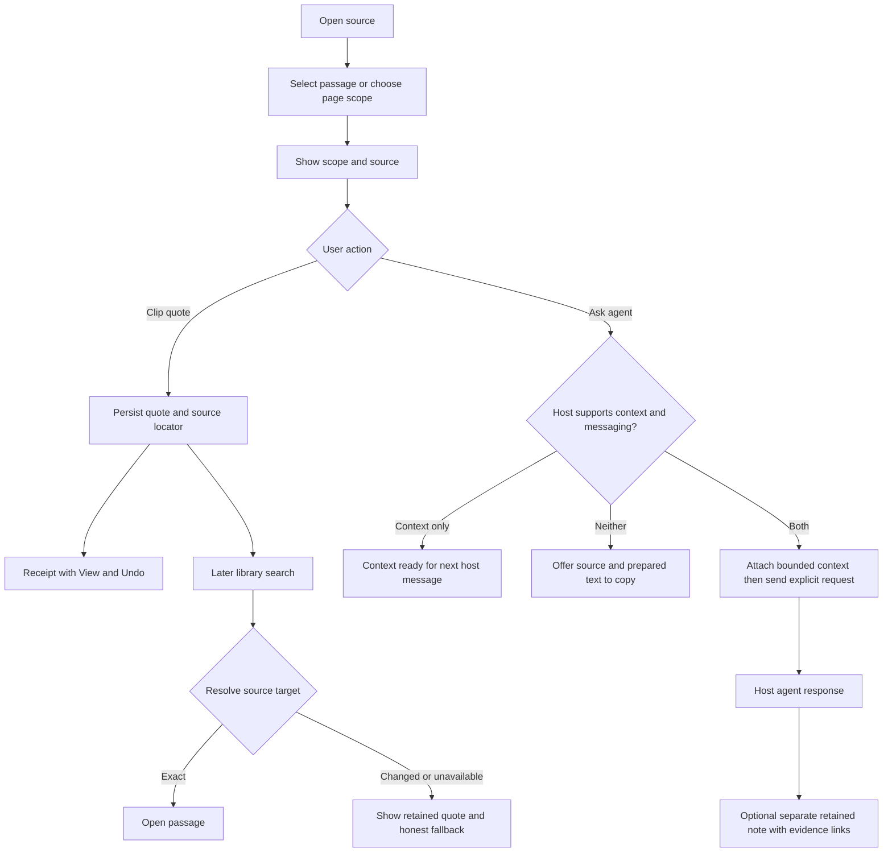

# Experience and design system

> Historical assessment at `75888bf`. Read the [current code reconciliation](current-baseline.md) before using this as an implementation backlog. Several proposed features subsequently landed on main.

Proposal · 8 October 2026 · First cohort: developers and researchers who already use agents

## One lifecycle, several content archetypes

The shared core provides identity, source, ownership, access, reading state, retention, annotation, retrieval, and actions. Archetypes contribute behavior. A layout is a way to display material; it does not define what the material is.

| Archetype | Distinct need | Specialized affordances | Shared contract |
|---|---|---|---|
| Article / essay | Sustained reading and comprehension | Reading measure, headings, progress, quotes | Open, source, save, locate, ask, clip |
| Documentation | Complete a task or inspect a reference accurately | Project/version, hierarchy, page search, code copy, symbol links | Same content and passage actions; version remains attached |
| Research source | Preserve evidence and revisit it | Citation metadata, page/section location, source-versus-note distinction | Same target and annotation model; richer document renderer when supported |
| Short post / microblog | Understand a contribution in context | Author, time, commentary, original source, reblog trail | Same blocks plus publication and attribution metadata |
| Agent output / personal note | Keep a useful interpretation or artifact | Origin conversation reference when available, generated label, supporting sources | Same collections and retrieval; separate authored content identity |
| Content dashboard / collection | Orient, compare, and choose what to open | Query, grouping, density, freshness, finite catch-up | References to content; no duplication merely to change layout |
| Media | Inspect a non-text source and return to a moment | Transcript, captions, timestamp/page/region where supported | Same identity, provenance, locator envelope, and capability fallback |

The research archetype need not start with a full PDF editor. Article evidence and honest PDF link/page fallbacks can test the lifecycle first. Specialized affordances are contracts to implement and validate, not a claim that the present renderer handles every format.

## Information architecture

Use three stable destinations inside an expanded workspace:

- **Room:** incoming sources, Continue Reading, finite catch-up, and user-arranged portals. Existing columns, shelves, and river remain view choices.
- **Library:** things deliberately retained, with one search over saved links, clips, and collections. Reading history is an explicit optional search scope, not an assumption that every opened item was saved.
- **Space:** the user's published or intentionally shared material. Access through the profile/share workflow initially; avoid giving an occasional action equal navigation weight before evidence warrants it.

“Portal” remains a configurable view in a room. A source supplies items; a collection groups retained references; a portal can display either. Prefer user-facing labels such as Sources, Saved, Quotes, and Collections over exposing the entire domain vocabulary.

Search has visible scope: **Library**, **This documentation**, or **These sources**. Results identify title, source, content kind, useful match text, and whether the match is an original passage or a personal/agent note. An agent may help reformulate a query, but ordinary search remains directly usable.

## Host surfaces and navigation

OpenAI's current inline-card guidance limits navigation depth, nested scrolling, and action count. This is a host-specific constraint; MCPortal should map the same task into an appropriate surface rather than assume identical app chrome everywhere. [OpenAI UI guidelines](https://developers.openai.com/plugins/concepts/ui-guidelines)

| Surface | Purpose | Contract |
|---|---|---|
| Conversation entry card | Present the requested result and a clear next step | One primary action; at most one secondary action under the cited OpenAI guidance. For example, a catch-up summary with Open room and a source link. No miniature application navigation stack. |
| Expanded room / reader | Sustained browsing, reading, source navigation, and retrieval | Request a supported expanded display mode. Preserve return location, filter, selection, and focus. Avoid competing with the host's main chat composer. |
| Host without expansion | Finish a bounded task | Show a compact result, separate tool result, or source link; expose a prepared prompt/context fallback when messaging is absent. Do not advertise expansion before checking it. |
| Text-only tools | Retrieval and action without graphical UI | Concise attributed results, stable references, explicit scope, and useful save/retrieve operations. |

The view may be destroyed at any time. Persist meaningful state server-side; use host/view state only for short-lived presentation restoration. The bridge's context update prepares a later model turn; it is not itself a request for an answer. [MCP Apps overview](https://apps.extensions.modelcontextprotocol.io/api/documents/overview.html), [capabilities](https://apps.extensions.modelcontextprotocol.io/api/interfaces/app.McpUiHostCapabilities.html)

### Proposed expanded reading workspace

This schematic describes hierarchy, not a new visual theme or fixed pixel layout.

```text
← Return to room                         Search library     Profile
───────────────────────────────────────────────────────────────────
Project / version       Source · author · freshness
Page navigation         Title                         [Save]
                        Section / source passage
                        Code, table, or media         On this page
                        Reading content               Your clips

Selection actions:      [Ask about selection] [Clip quote]
Context indicator:      Selection · Page title · Section
───────────────────────────────────────────────────────────────────
Saved quote → View in Library                         Undo
```

At narrow widths, the source remains central. Navigation and notes become labelled drawers or separate views; they do not compress the article into a sliver. Opening a drawer moves focus into it and closing restores focus. Code and genuinely two-dimensional tables can scroll locally; the general page should reflow.

### Proposed retrieval result

```text
Search: “heartbeat reconnect”        Scope: Library ▾

Heartbeat behavior                   Documentation · Project v2
“…retry after the heartbeat interval…”
Saved quote · Section: Reconnection · Source available
[Open passage]                       [More actions]

My explanation of reconnect behavior Agent note · 8 Oct
Based on: Heartbeat behavior, Project v2
```

Keep the evidence and explanation adjacent when useful, without presenting generated wording as the source author's claim.

## Journeys and observable outcomes

These are task hypotheses, not demographic personas or findings from interviews. Each journey supports entry through either the agent or direct UI.

### 1. First useful session

**Trigger:** “Bring the sources I use for this project into my agent.”

1. Open a small sample room or add a source directly. Permit exploration before requiring an account where the deployment allows it; identify temporary state clearly.
2. Choose one suggested source pack, paste a URL, or import OPML. Preview the resulting sources before committing a large import.
3. Open an item and demonstrate one useful source-linked action.
4. Offer durable account setup when the user chooses to retain or synchronize material and the deployment requires it. Local durable storage remains a valid local mode.

**Failure/recovery:** invalid or unreachable sources stay editable; partial imports report successes and failures separately; do not replace the user's room. Empty sources get a clear reason and source link.

**Success:** the participant reaches a relevant source and can explain what is temporary, what persists, and where to return. Source configuration completion alone is insufficient.

### 2. Developer catch-up → documentation → action

**Trigger:** “What changed in the libraries I follow that matters to this project?”

1. Open a bounded catch-up, showing time boundary, selected sources, and collection coverage.
2. Inspect a release or post, with recommendation reason if an agent selected it.
3. Follow into the relevant documentation and retain project/version context.
4. Ask about a selection using the host conversation. Attach source and locator through an explicit action.
5. Save the link or quote, then return to the same room position. Mark read only through the defined reading behavior, not merely because an answer was generated.

**Failure/recovery:** incomplete feed history is labelled; broken extraction offers the original; a version mismatch is visible; unavailable messaging offers a context/copy fallback. A failed save leaves the content and selection available for retry.

**Success:** participant identifies a relevant change, checks supporting evidence, and can return to it. Record unnecessary host switches and mistaken assumptions about completeness.

### 3. Researcher → evidence → synthesis

**Trigger:** “I need to compare claims across sources and keep the evidence.”

1. Open a source from a feed, link, search result, or agent result.
2. Select a passage, choose Clip quote, and optionally attach a short note and collection.
3. Show a receipt with the source and a route to the retained quote.
4. Add another source to the same collection.
5. Ask the agent to compare the collection. The scope lists included material and omissions; generated synthesis is retained as a separate note with evidence references.

**Failure/recovery:** an unavailable full text remains a link with explicit coverage; repeated or moved quotes offer candidate locations; unsupported PDF selection falls back to a cited page/link without pretending exact extraction occurred.

**Success:** a participant can distinguish source quotation from interpretation and reopen the supporting location. Counting saved clips alone would miss the value.

### 4. Return in a later conversation

**Trigger:** “Find the passage about reconnecting; I cannot remember where I saw it.”

1. Search the Library directly or ask the agent, with the same authorization and content scope.
2. Show an original source hit and related retained notes, with matched passages.
3. Open the best source target; resolve against the retained or current source revision.
4. If exact resolution fails, keep the saved quote visible and explain the fallback: nearby section, changed page, or unavailable source.
5. Continue reading from the result and return to search with the query intact.

**Failure/recovery:** broaden to reading history only through an explicit scope change; show which stores were searched. A new host needs the same hosted account for shared continuity; a local-only store does not automatically travel with the user.

**Success:** the intended evidence is recovered without remembering the exact title, and the user understands any approximation.

### 5. Publish a useful contribution

**Trigger:** “Share this short reading note and the source.”

1. Start with an existing clip or link; add commentary without modifying the original.
2. Preview exactly what will be published, including audience, attribution, attached material, and any generated label.
3. Publish through an explicit action, or through an agent request that clearly specifies publication intent and destination.
4. Show the published location and available edit/remove actions. A recipient can save or reblog with preserved attribution.

**Failure/recovery:** private annotations and collection membership never become public merely because a link is shared. Removed originals remain honestly marked. Retry must not publish duplicates. Removal cannot promise to erase copies already made by others.

**Success:** the author and recipient can both explain whose words they are seeing and what was shared. Test this later in the first study cycle; it need not gate the first read-and-retrieve slice.

## Passage-to-agent flow



If only messaging is available, use a bounded, explicitly attributed message payload rather than silently assuming a separate context channel. A host may also refuse an advertised action at runtime; every branch needs a visible error or fallback.

## Design-system plan

Retain the current print-inspired identity, generated tokens, host color adaptation, and readable type. Extend the [existing design system](https://github.com/lbliii/mcportal/blob/75888bf901c9cc28924a403168a374beff0e454a/docs/design-system.md) with behavioral contracts. A new content format should inherit common actions and states, while documenting its specialized controls.

| Layer | Required additions | Acceptance evidence |
|---|---|---|
| Foundations | Reading density guidance; source/generated/private/published semantics; consistent motion and focus restoration | Existing tokens remain the source of truth; no arbitrary host overrides or duplicate palette |
| Primitives | Source label, scope chip, locator link, progress indicator, action receipt | Accessible names, keyboard reachability, wrapping, forced colors, clear pending/error states |
| Content patterns | Result row, article body, code/table, quote, personal note, share/reblog, unavailable-source placeholder | Shared attribution/actions; source kind cannot be inferred only from color or icon |
| Task patterns | Catch-up, documentation navigation, selection actions, library search, collection editing, publication preview | State survives navigation; action semantics and recovery match across archetypes |
| Host adapters | Inline result, expanded workspace, text fallback | Actual host tests, including unsupported capabilities and teardown |

### Action semantics

| Label | Promise | Recovery |
|---|---|---|
| Save | Retain a link/reference; show separately whether a readable copy is preserved | Unsave without deleting independent clips |
| Clip quote | Retain the selected text and attribution, plus the best available locator | Undo/remove the clip; keep source link |
| Ask about selection/page | Send the displayed scope to the host agent through a deliberate action | Correct scope or request; do not imply sent context can be retroactively erased |
| Mark read | Record the user's completion intent | Mark unread; reaching the end alone need not set it |
| Share | Open a publication action with clear audience and content | Draft discard; published edit/remove where supported |
| Open original | Navigate to the upstream source | Preserve the return route in MCPortal |

Use the same verb for the same effect across direct UI and agent receipts. A pending action must not announce a confirmed save until persistence succeeds. Readable messages such as “Quote saved to Library” are stronger than generic “Done.”

### Required state coverage

Every content pattern needs initial loading, partial success, empty, unavailable, stale, permission-denied, pending mutation, confirmed mutation, and failed mutation designs as applicable. Distinguish an empty collection from a failed query. Show a locally available retained quote when its original disappears. Avoid blocking the entire room because one source failed.

### Accessibility and responsive behavior

Keep existing target and contrast safeguards. Add task-level verification: source and selection navigation by keyboard; focus return after readers/drawers; announced save/error status; useful heading structure; screen-reader distinction between quotation, source, and note; text resize and reflow; reduced motion; and input that does not require precision dragging. Provide an accessible route to clip a passage even when native text selection is difficult, such as a paragraph action that opens editable quote text with attribution.

Test a 320 CSS-pixel equivalent reading viewport and 400% zoom scenarios, allowing essential two-dimensional content its appropriate exception. The WCAG 2.2 target-size minimum is 24×24 CSS pixels with specified exceptions; the current 44px coarse-pointer target is a product choice for comfort. These checks are part of a conformance review, not a claim of complete conformance. [Reflow](https://www.w3.org/WAI/WCAG22/Understanding/reflow.html), [target size](https://www.w3.org/WAI/WCAG22/Understanding/target-size-minimum.html)

The visual work should preserve calm reading and make action scope legible. Additional decoration should wait until people can complete the core tasks without explanation.
