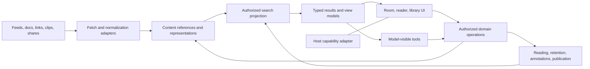

# System architecture for a shared content platform

> Historical assessment at `75888bf`. Read the [current code reconciliation](current-baseline.md) before using this as an implementation backlog. Several proposed features subsequently landed on main.

Proposal · 8 October 2026 · Build incrementally from `75888bf`

## Architectural decision

Keep the current modular monolith, direct TypeScript runtime, adapter boundary, and file/Postgres storage contracts. Introduce a common content-reference and action contract before reorganizing physical storage. The important new abstraction is a stable relationship between a source, its representations, user state, and derived work. A large generic content-management framework is unnecessary for the first lifecycle proof.



These are module responsibilities, not proposed network services. Existing adapters and stores remain authoritative while new read projections unify their outputs.

## Separate the axes

| Concept | Purpose | Example |
|---|---|---|
| Source | Where material arrives from, with connector and fetch policy | A project's release feed |
| Content reference | Stable identity within an access scope | A particular documentation resource |
| Appearance | Why this item is visible here | Arrived via a feed; recommended by a followed author |
| Revision / representation | Which body is available and how it is rendered | Extracted text at a known digest; original URL; PDF attachment |
| Archetype behavior | Specialized interaction and navigation | Versioned docs tree; media timestamps |
| User state | A person's relationship to content | Saved, reading progress, explicit read, private tags |
| Annotation / derived content | A quote, comment, or synthesis with targets | A retained quote; an agent note citing two sources |
| Collection / view | Membership or a query and presentation | Evidence collection displayed as a list |
| Publication | An intentionally disclosed contribution | A note and source link shared to a Space |

The same upstream URL does not imply identical content, audience, or revision. A share is its own authored publication even when it references an existing article. A docs version must not be silently merged into another version. A generated explanation is a separate content object linked to evidence.

## Minimum reference contract

The following shape is illustrative design, not a shipped API or migration script:

```ts
type ContentRef = {
  schemaVersion: 1;
  id: string;
  kind: 'article' | 'docs' | 'post' | 'note' | 'media' | 'link';
  accessScopeId: string;          // authorization is enforced server-side
  source: {
    adapter: string;
    nativeId?: string;
    originalUrl?: string;
    canonicalUrl?: string;
    versionLabel?: string;
  };
  title: string;
  authors?: string[];
  currentRevisionId?: string;
};

type Representation = {
  id: string;
  contentId: string;
  mediaType: string;
  digest?: string;
  normalizerVersion?: string;
  coverage: 'full' | 'partial' | 'metadata-only';
  retention: 'temporary-cache' | 'retained-copy' | 'external-only';
  retrievedAt?: string;
};
```

Use a stable opaque internal ID, with aliases from current item, clip, share, and conservative URL identities. The existing `Item` remains a view model during migration. Content kinds need not cover every format immediately: an unsupported object can honestly be a link with metadata and an original-source action.

### Identity rules

1. Prefer an upstream stable ID within its adapter and access scope where available.
2. Use conservative URL normalization otherwise. Removing fragments can identify a resource while retaining the fragment in a locator. Preserve meaningful path, query, version, and case distinctions unless an adapter has evidence they are equivalent.
3. Record redirects and validated canonical relationships as aliases; do not blindly trust a page's canonical tag to merge private or versioned objects.
4. Keep appearances separately, including source portal and social attribution. Deduplicated display may summarize multiple appearances without erasing them.
5. Treat revising a body, connecting an item to another collection, and publishing a contribution as different operations.

Do not merge private records across accounts just because their URLs match. Public source bodies may use a shared fetch cache only under a policy that excludes private credentials and user activity metadata. Content IDs never confer access by themselves.

## Durable passages and reading continuity

Existing heading/block hints are useful for resume but are fragile when extraction or source text changes. Add a locator to retained quotes and search hits, reusing it for more accurate reading restoration.

| Locator field | Role |
|---|---|
| Content ID and representation/revision ID | Identify the source version the person actually saw |
| Exact quote plus bounded prefix/suffix | Match text with surrounding context |
| Heading path and source fragment | Human-readable fallback and source navigation |
| Block ID/index and text offset | Fast path when the same normalized representation is available |
| Progression | Approximate reading fallback, explicitly not an exact quotation target |
| Format extension | Page, timestamp, or region only when that renderer supports it |

The W3C annotation model supplies a useful body/target separation and quote-selector vocabulary. Readium demonstrates a resource locator that can carry position and text context across formats. MCPortal can adopt these concepts without claiming full interoperability until import/export contracts are implemented and tested. [Web Annotation](https://www.w3.org/TR/annotation-model/), [Readium locators](https://readium.org/architecture/models/locators/)

Resolution order: exact retained revision and selector → unique quote/context match in current text → source fragment/heading → approximate reading position → source start. Record outcomes as exact, relocated, ambiguous, or unavailable. Never silently convert an ambiguous repeated quote into an exact citation. Show the retained quote alongside the available fallback.

Distinguish **retaining a quote**, **saving a link**, and **preserving a readable copy**. The first can remain useful after a source disappears; the second cannot promise offline access; the third requires explicit retention policy, quota, export/deletion support, and content availability. Source caches with expiry are not durable saved copies.

## State ownership and lifecycle

| State | Authority and lifetime | Existing foundation / next change |
|---|---|---|
| Room layout and preferences | Account/local profile; durable | Keep existing profile operations |
| Saved references | Currently profile; durable subject to limits | Read through a library projection first; move to a dedicated store only when needed |
| Reading progress and completion | Reading store; user-specific | Extend current contract with version-aware locators and surfaced save failures |
| Clips and annotations | Clip store; durable | Add target information additively; old clips remain valid URL-attributed records |
| Full retained representations | Explicit retained-content store | Add only for a declared preservation feature, with quotas and deletion |
| Source fetch cache | Temporary; freshness and privacy rules | Never use as proof of permanent retention |
| View filter, drawer, focus, return route | Session/view state | Restore where possible; never the sole copy of user content |
| Conversation handoff | Existing bounded, expiring handoff mechanism | Treat as transfer, not permanent evidence storage |
| Search index | Rebuildable derivative | Apply access scope; remove entries on deletion/revocation |
| Publications | Social store; intentional disclosure | Preserve attribution and tombstone semantics |

The current reading store and clips are the starting points. An architecture diagram naming a new concept is not authorization to rewrite all stores or require hosted storage for local use.

## One action contract for UI and agent

Domain operations should validate identity, authorization, payload limits, and state transitions regardless of caller. Direct UI calls are appropriate for navigation, saving, clipping, and simple filtering; the agent is useful for interpretation and composition. Tool visibility can differ even where operations share implementation.

Each mutation returns a typed receipt: affected reference, committed state, display message, and a supported recovery action if available. Use a request key for retryable operations such as creating a quote or publishing; persist deduplication with the authoritative write. A client timeout must not cause a duplicate clip or post on retry. UI optimistic state needs rollback or reconciliation after a failed request.

Keep incremental writes for frequently changing progress. Serialize or version competing updates so closing an older view does not overwrite newer progress. Some state is naturally monotonic, such as a last-opened time; explicit mark-unread and user repositioning need intentional conflict rules rather than a universal max-value merge. Add file and Postgres contract cases for the same scenarios.

Use the existing access and schema plumbing in [tool kit](https://github.com/lbliii/mcportal/blob/75888bf901c9cc28924a403168a374beff0e454a/src/tools/kit.ts) and [schema validation](https://github.com/lbliii/mcportal/blob/75888bf901c9cc28924a403168a374beff0e454a/src/lib/schema.ts). Proposed names such as `search_library` describe capabilities; reconcile them with the actual checked-out tool surface before implementation.

## Model context and embedded UI

Construct a bounded context bundle from the user's selected scope. Include reference IDs, titles, source URLs, revision/coverage where relevant, selected text, and explicit source delimiters. A selected passage is untrusted source material; it does not acquire authority to issue tool calls. Delimiters help interpretation but do not replace tool authorization, payload validation, or safe rendering.

Do not send every item in the room or a complete private document merely because a component needs it to render. In OpenAI's documented result contract, both `content` and `structuredContent` are model-visible; `_meta` is component-only. The current local result type needs an explicit extension or a separate supported resource path before relying on that split. Test the actual host rather than assuming every MCP client treats fields identically. [OpenAI result reference](https://developers.openai.com/plugins/reference)

Context attachment and sending a host message are distinct operations. The UI should distinguish “Ready for your next message” from “Sent to your agent.” If context succeeded and message sending failed, preserve that state and avoid duplicate sending on retry. A new conversation must reacquire authorized content using stable references rather than depend on a surviving iframe.

Honor the current sandbox and CSP boundaries. Render normalized blocks rather than arbitrary active source HTML. Sanitize URLs and fetches under the existing network safeguards, and avoid executing content-provided scripts. Recheck authorization on every resource and action, including requests originating in the view.

## Search and retrieval plan

Start with a unified authorized read projection over saved links, clips, and optionally reading history. Return one ranked list with explicit source kind, match origin, source target, and availability. A note and its source can appear as related results without being merged.

For hosted storage, PostgreSQL full-text search can index weighted titles, headings, body excerpts, notes, and tags. Preserve an exact-match route for identifiers, code symbols, URLs, and version strings; natural-language tokenization alone is insufficient for developer queries. The local store can implement the same result contract with an in-process index at its bounded scale. [PostgreSQL text-search controls](https://www.postgresql.org/docs/current/textsearch-controls.html)

Scope authorization must apply before candidate text or snippets leave the server, including any later embedding pipeline. Search private and public corpora under distinct access policies. Return coverage information when only titles or retained excerpts are indexed. Provide deterministic pagination and stable ties; maintain the query and selected hit on return.

Evaluate lexical retrieval before adding embeddings. Add semantic retrieval only when the benchmark demonstrates meaningful misses that a hybrid method improves without degrading symbol precision, latency, isolation, or source traceability. A graph database is not required to represent a handful of typed relationships in the initial scope.

## Background collection and scale

The present request-driven source fetches cannot establish complete history between visits. A later collection worker needs durable source subscriptions, cursors, idempotent item ingestion, bounded concurrency, rate-limit backoff, and visible last-success/coverage state. A transactional job/outbox pattern becomes useful when a content mutation must reliably update an asynchronous index or notification pipeline.

Build a durable in-product inbox before host-specific notifications. The app view is not a worker, and the host bridge does not guarantee background execution. Use finite batches and explicit caught-up boundaries. Personalized ordering must preserve user-controlled source arrangements and expose understandable reasons.

Measure before splitting services: ingestion queue lag, source failure rate, authorized-search latency, content-open latency, store size, and indexing cost. Add dedicated workers when persistent jobs require them, and specialize stores only when observed workloads justify it.

## Incremental migration and release safeguards

1. Add versioned references and locators at adapter/tool boundaries while accepting legacy IDs. Use additive fields and capability/version checks for older views.
2. Implement the library as a projection over current stores. Maintain direct UI and model result parity for IDs, permissions, and action semantics.
3. Add durable representations only for the agreed retention promise; backfill references in bounded, restartable batches with mappings from old identifiers.
4. If saved links outgrow profile storage, migrate them with an explicit version and rollback path. Avoid indefinite dual-write systems; compare old/new reads before switching authority.
5. Extend export, account deletion, permission revocation, and index invalidation at the same time as every new durable store. Retained public copies have an explicit ownership policy; private derived indexes must be removed with their source access.
6. Verify schema migration and restore using a disposable database before deployment. Keep production backup/restore and actual-host checks in the release evidence, as required by the existing [operations guide](https://github.com/lbliii/mcportal/blob/75888bf901c9cc28924a403168a374beff0e454a/docs/operations.md) and [host checklist](https://github.com/lbliii/mcportal/blob/75888bf901c9cc28924a403168a374beff0e454a/docs/host-compatibility.md).

This plan does not require a protocol upgrade, microservices, a vector database, or a UI framework migration. Each can be evaluated independently when a concrete requirement emerges.
