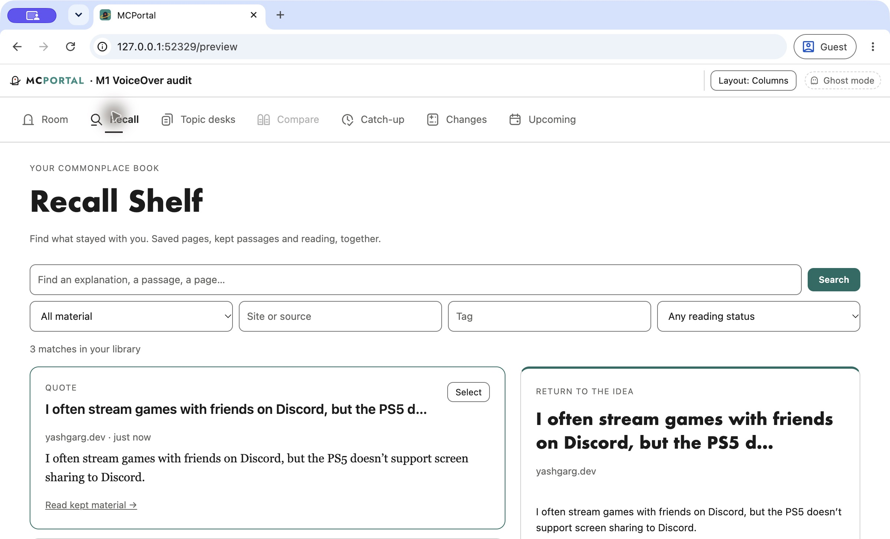

# M1 accessibility proxy audit

Date: October 8, 2026. This is an agent user-proxy evaluation using deterministic local fixtures. It is not a session with a disabled participant, a screen-reader spoken-output evaluation, an elapsed one-week trial, or certification of a real MCP host.

## Scope and method

The proxy represents a keyboard user who needs to open a source, act on a passage without precision text selection, find saved reading through Recall, and return to the prior context. Additional checks represent a narrow-display / larger-text user and a user with forced colors or reduced motion enabled.

Executed the repository's headless Chrome harness (`test/browser.ts`) against a temporary local server from `test/helpers.ts`. The room used fixture feed/article fetching, `MemoryProfileStore`, `DocumentExperienceStore`, and a `FileReadingStore` in a temporary directory. No production user data or external messages were used. Temporary standalone audit source and machine observations are at `/private/tmp/m1-accessibility-proxy.mts` and `/private/tmp/m1-accessibility-proxy-evidence.json` for this run; these files are not retained repository artifacts. The fixture article was `https://yashgarg.dev/posts/ps5-rtmp`; the saved item was named “Hijacking the PS5.” A second saved item, “Keyboard research notes,” allowed independent Recall-preview selection.

For keyboard activation, the harness focused an identified native control and dispatched Chrome DevTools `Input.dispatchKeyEvent` events: `rawKeyDown`, Enter `char` (`\r`), and `keyUp`, with Enter virtual key code 13; Tab used virtual key code 9. `Page.bringToFront` preceded key input. This tests native control activation and focus behavior, but does not claim an exhaustive end-to-end sequential Tab traversal of every source in a long room. An initial attempt using incomplete key events did not activate the button; that harness failure is excluded from product findings.

Browser checks required approved unsandboxed execution because local server / Chrome startup under the workspace sandbox failed. The Node 24.9.0 and bundled Node 24.19.0 test runner crashes seen before approval are environment failures, not product failures. The parent agent was integrating the reader changes; findings below identify whether they were observed before or after those in-progress edits.

## Initial findings sent for repair

| ID | Finding and reproduction | Evidence / impact | Status |
| --- | --- | --- | --- |
| A1 | Before the proxy-driven repair, open an article or docs page using keyboard controls and seek a passage action. The only path was a browser Selection (`selectionchange`); ordinary prose had no focusable passage-action entry. | Source inspection of `src/ui/room/passage.js`; no picker or equivalent action. A user unable to perform precise text selection could not initiate the core quote/ask journey. | Fixed; default and non-default passage clipping verified by keyboard, including the native Chrome popup follow-up below. |
| A2 | Open “On this page,” then press Escape. | Existing browser test `reader UI: Escape dismisses passage and outline before leaving, headings scale with text preferences` failed at line 175: `outline.open` remained `true`. Escape handler searched `#reader` even though controls moved to `#readerControls`. | Fixed; existing Escape regression passes. |
| A3 | In Recall with two results, focus the second `.recall-title` (“Keyboard research notes”), then press Enter. | Preview updates, but `document.activeElement` becomes `BODY`. Next Tab focuses the first result's “Select Hijacking the PS5” control. `drawRecallResults()` replaces the focused result. This loses the user's position on every preview change. | Fixed; native Enter keeps the same result title focused and next Tab reaches its Resume action. |
| A4 | Focus the saved article button in the room and activate it; separately activate “Resume reading” from Recall. | Article opens, but focus becomes `BODY` in both paths. There is no focus destination announcing or positioning the new view. Back navigation itself restores the original triggering control correctly. | Fixed; both paths focus the article H1; return focus still passes. |

## Checks completed before repair retest

- Native keyboard activation of the saved article opened the correct reader. Back returned focus to the original `button.item-main`, “Hijacking the PS5.”
- Recall search for `Hijacking` with kind `saved` returned one result. Opening it and returning preserved the query, kind, and focus on “Resume reading →.”
- Reader and Recall had no document-level horizontal overflow at viewport widths 320 and 360 CSS pixels with root text sizing set to 200%. Reader was also measured at 100% text. This is root-font text enlargement, not OS magnification or a browser zoom certification.
- Visual inspection of the 320-pixel / 200% reader screenshot showed wrapped controls and a readable, enlarged title and body. The full title occupies several lines; it is not horizontally clipped. The 360-pixel forced-color screenshot showed legible black-on-white content and a visible Back focus ring.
- Chrome emulation confirmed both `(forced-colors: active)` and `(prefers-reduced-motion: reduce)` matched. The tested reader had no active animations. The focused Back control had a computed solid 2-pixel outline. This is a bounded browser check, not a full contrast audit.
- The accessibility tree exposed the Reader region, Reader controls group, article/section headings, and named native actions. This demonstrates exposed semantics only; no screen-reader speech was observed.
- The completed standalone audit recorded zero browser console/exception problems.

Targeted baseline command:

```sh
node --test --test-name-pattern='semantic groups|Escape dismisses|every code|page find' test/reader-ui.test.ts
```

Result before the Escape repair: **3 passed, 1 failed**. Semantic groups / source outline navigation, code copying with denied-clipboard fallback and scrollable tables, and literal page-find behavior passed. The failure was A2 above.

## Final repair verification

All four initially reproduced findings have been addressed in the tested fixture flow. No remaining product blocker was reproduced in this audit's bounded scope.

The same targeted reader command now reports **4 passed, 0 failed**. A fresh run of `/private/tmp/m1-accessibility-proxy.mts` confirms:

| Transition | Final observed focus |
| --- | --- |
| Room saved item → reader | `H1`, “Hijacking the PS5's RTMP Stream” |
| Reader → room | Original `button.item-main`, “Hijacking the PS5” |
| Recall second result title → preview | Matching `button.recall-title`, “Keyboard research notes” |
| Tab after that preview change | That row's “Resume reading →” button |
| Recall result → reader | Article `H1` |
| Reader → Recall | Original “Resume reading →” button; query `Hijacking` and kind `saved` preserved |

The additional temporary picker audit (`/private/tmp/m1-picker.mts`) uses no pointer text selection. Enter opens “Choose passage”; Tab reaches the native select named “Passage to use”; keyboard activation of “Clip quote” retains the default passage and its source. The browser text selection remains empty throughout. Escape closes the picker, focuses “Choose passage,” and leaves the reader open. Recall filtered to quote shows the retained text and `yashgarg.dev` source.

At 320 and 360 pixels with 200% root text, the open picker panel measures 272 and 312 pixels wide, respectively; it stays within the viewport and is limited to 340 pixels high with internal scrolling. Document width remains equal to viewport width. Screenshot inspection confirms enlarged source address, select, and passage preview wrap inside the panel.

The initial headless native-select ArrowDown sequence did not change the selected option. A separate functional pass (`/private/tmp/m1-picker-change.mts`) set select value `2` and dispatched its standard `change` event, then activated “Clip quote” by keyboard. The exact Discord paragraph and source appeared in Recall, with empty browser Selection. That functional check alone did not establish native keyboard option selection; the follow-up below resolves this evidence gap.

Final standalone and picker audit runs each recorded zero browser console/exception problems. Existing source/outline semantics, clipboard-denial fallback, local page find, narrow reader fit, forced colors, and reduced motion checks are described above without expanding them into human or host certification.

## Remaining evidence limits

Actual VoiceOver/NVDA output, real MCP host iframe behavior, touch assistive technology, speech input, OS/browser zoom, and usability with people remain untested. Agent emulation can expose mechanical blockers and support a scoped milestone decision; it cannot supply human comprehension, satisfaction, or week-long retention measurements.

## User-directed VoiceOver skip

On October 8, the user approved a temporary VoiceOver audit, then explicitly requested: “lets skip voiceover testing. can you disable it again?” The attempted audit used candidate `303e8e9` in an isolated Chrome Guest window and disposable local fixture server. VoiceOver's caption application could not be inspected, and no actual spoken-output evidence was obtained. System Settings subsequently showed VoiceOver **off**; that state was reverified after the user's request. The Guest audit window was closed and the fixture server exited successfully. VoiceOver testing is skipped by user direction, not passed or represented by the prior AX checks.

## Native keyboard popup follow-up

On October 8, candidate `21720da70cee37d25a7da03af60aee98d5fe7b4f` passed the previously missing non-default option check in native macOS Chrome Guest, with VoiceOver off. Computer-use keyboard actions operated the native popup against a disposable local fixture server. No JavaScript assignment or synthetic select-change event was used for this check.

After opening the fixture article, focus was on its H1. Three Shift+Tab presses reached “Choose passage”; Return opened it and Tab focused “Passage to use.” Space opened the native menu containing 11 choices. Down, Down, Return selected the third passage. The selected control value and preview both showed: “I often stream games with friends on Discord, but the PS5 doesn’t support screen sharing to Discord.” Tab focused “Clip quote”; Return produced the successful clip notice while retaining button focus. Escape closed the chooser and restored focus to “Choose passage,” leaving the reader open.

Opening Recall then showed the exact retained paragraph and `yashgarg.dev` source in both its result and preview. Article setup and opening Recall used pointer navigation; the passage chooser, non-default selection, clipping and dismissal used only keyboard input. This is a bounded native-control check, not a claim that this entire follow-up traversed every view by keyboard. The Guest window was closed and the fixture server exited successfully afterward.



The fixture profile retained its earlier “M1 VoiceOver audit” label in this screenshot. VoiceOver was off; this image is evidence of keyboard clipping and retained content only.
