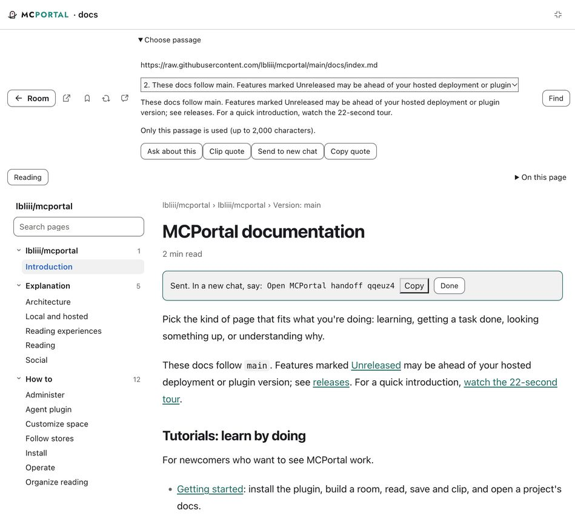
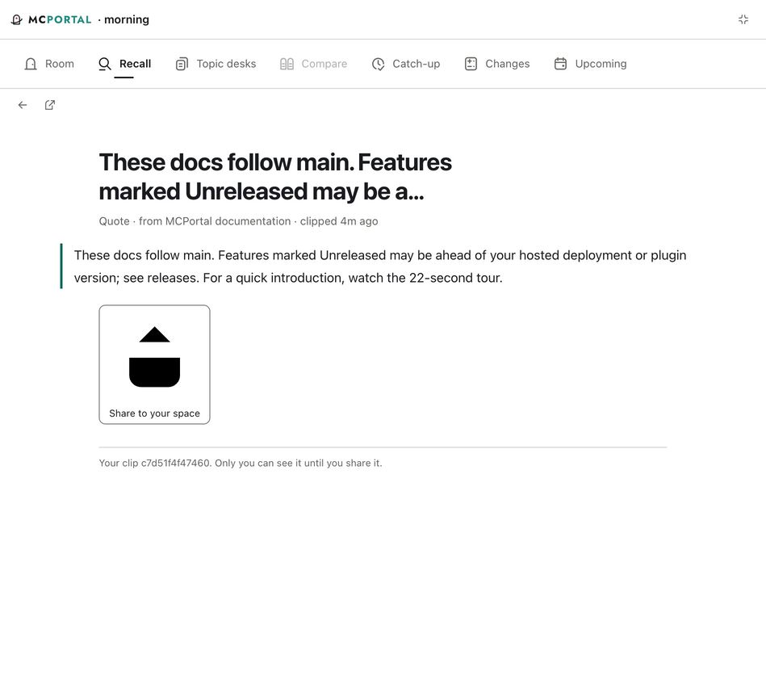
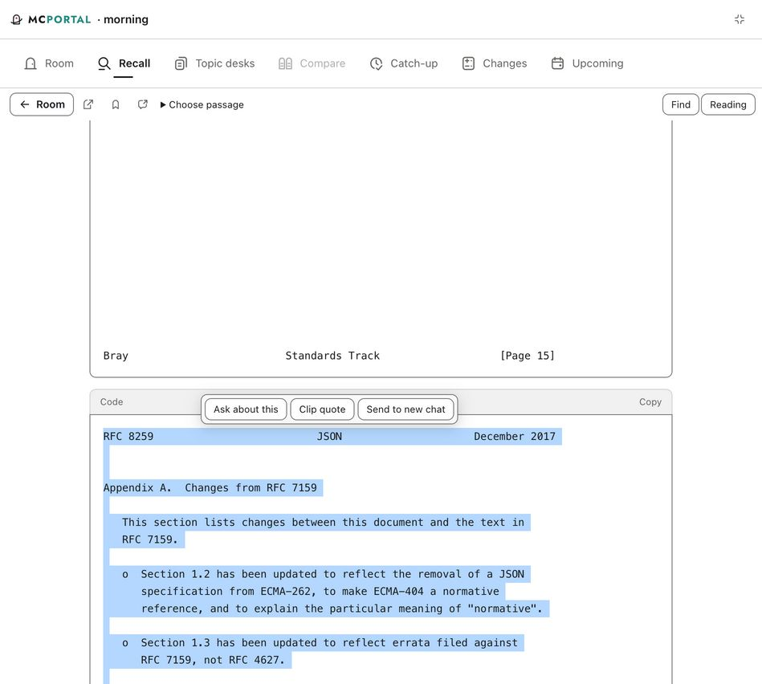
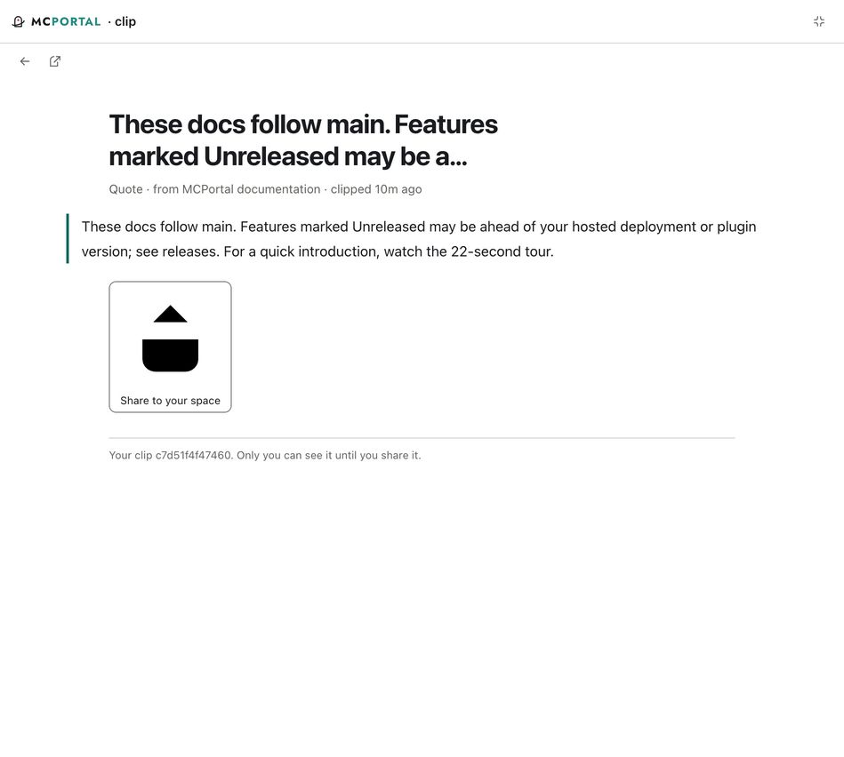

# M1 Codex host validation

October 8, 2026. The candidate's reading, clipping and retrieval loop ran in the actual Codex MCP Apps host. A second chat retrieved the exact UI-created handoff and clip. The remaining checks are the reopened handoff's rendered position and agent receipt of the passage sent with Ask; this report does not yet certify the entire loop or other hosts.

## Environment and scope

- Codex installed version `26.1002.52244`, build `13536`, bundle `com.openai.codex`, read from installed app metadata. This is not a captured `ui/initialize` response.
- Candidate application at `303e8e9`; subsequent commits through `649b75e` change evidence only. A follow-up CSS repair sizes icons inside text buttons. The isolated local STDIO connection is named `mcportal-m1`; the normal local connection and public deployment were not modified.
- Public sources only: this repository's main-branch docs and RFC 8259. Test records belong to a temporary local identity and separate data directory. Same-identity continuity here does not establish hosted sign-in continuity.
- The inspected expanded viewport measured 949 × 852 CSS pixels. Exit fullscreen closed the inspectable panel; inline cards are unavailable to this inspection backend. A new expanded clip used a different view initialization ID.
- VoiceOver was explicitly skipped by the user and left off. Native Codex inspection was denied; all rendered-host observations below use the supported MCP Apps surface.

## Observed results

| Check | Actual result |
| --- | --- |
| Candidate build | Reader controls are outside `#reader`, under `#readerControls`; Choose passage is present. The older public deployment has different markers and is excluded from candidate results. |
| Docs scope and selection | Selected the second option, block 1, from 35 passages on the docs introduction. The chooser showed the exact source URL, full paragraph and the limit “Only this passage is used (up to 2,000 characters).” |
| Clip | Clip quote produced its success notice. Search returned clip `c7d51f4f47460` with the exact passage, source URL and block-1 locator. |
| Handoff creation | Send to new chat produced code `qqeuz4`, created at 14:44:24 UTC, expiring October 15 at the same time. |
| Separate chat | A real second Codex chat used only candidate tools to open that handoff and retrieve that clip. Both returned the original source and exact quotation; handoff anchor and clip locator were block 1. Text was fenced as untrusted source content. That chat had no expanded UI. |
| Ask | Ask about this displayed “Asking your agent…” after the context and message requests resolved. The next model turn and its exact context have not been observed; successful bridge feedback alone does not prove model receipt. |
| Docs navigation | Architecture opened through Contents with its heading focused and its own raw-source URL. Open the original opened the corresponding GitHub page in Codex's browser. No consent dialog was observed. |
| Room | Open your room reached onboarding; Skip hydrated the isolated morning room, including an observable pending state. |
| Recall | Searching “These docs follow main” returned the clip. Read kept material showed the exact retained quotation. Back preserved the query and focused the same result action. |
| Article and position | A temporary saved RFC 8259 link opened through Recall. Find returned two matches for “vast majority”; controls stayed outside the article scroll area. After return and resume, stored block 19 was 16.1 pixels below the reader top. The reading record independently retained block 19. This is semantic-position restoration, not exact scroll-pixel preservation. |
| Clipboard fallback | Copy code selected the text and displayed “Text selected. Use your keyboard or context menu to copy.” The host did not expose the clipboard failure reason; the evidence does not distinguish absence from denial. |
| Fresh clip view | After Exit fullscreen closed the old panel, a new Get clip card restored the same quote, source title and clip ID. The old iframe was not needed for retained content. |
| Text-only error | A missing handoff code returned a useful error explaining the seven-day lifetime and how to create a new handoff. |

The exact retained passage was:

> These docs follow main. Features marked Unreleased may be ahead of your hosted deployment or plugin version; see releases. For a quick introduction, watch the 22-second tour.

Its source was `https://raw.githubusercontent.com/lbliii/mcportal/main/docs/index.md`.

## Screenshots

The retained-clip screenshots exposed an oversized Share icon: its SVG measured 116.2 × 116.2 pixels. The follow-up repair applies the existing icon token and stroke treatment to icons directly inside text buttons. No sharing action was performed.

## Evidence boundaries and remaining checks

The actual host accepted server tool calls, source links, context/message requests and fullscreen exit. These are observed actions, not a captured raw capability response. Context-only and message-only combinations, denied source links, missing capabilities, unavailable sources, wrong-account access and seven-day expiry remain fixture/storage-test evidence. A single running host cannot establish all capability combinations.

Hosted sign-in, its permission/expiry/import paths, inline visual layout and raw initialization capabilities remain unverified here. Claude desktop/web/mobile, Claude Code and ChatGPT remain untested for this candidate. Their historical usage status is not changed by this Codex run.

Finish the rendered handoff return-location check, verify the icon repair in a fresh resource, and observe the Ask-generated model turn before declaring the selected-passage-to-agent chain complete. The [compatibility checklist](../docs/reference/host-compatibility.md#certifying-a-host) remains the broader host-certification contract.

After the CSS repair, server/UI type checking and generated design checks passed. The existing passage, reader and host-navigation tests passed: 28 tests, 28 passed, none failed or skipped. The prior full candidate suite passed 550 of 576 with 26 documented skips; see the [integration report](m1-core-content-loop.md#validation).
